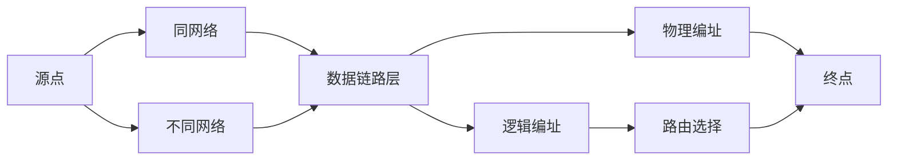
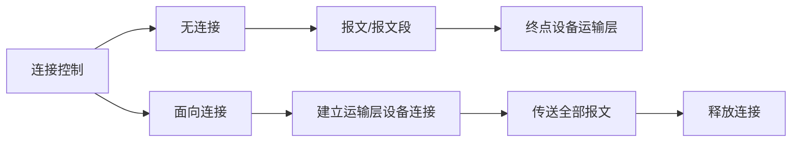

  # 《TCP/IP协议族》读书笔记
  @(网络的本质与作用)[分层|以太网vsTCP/IP网络|分组转发|通信->地址]
  @[以太网交换机|一卡通专网网络拓扑]
  

## OSI模型

<table width=500px><tr><td bgcolor=#81C0C0>
  7. 应  用  层：允许访问网络资源</td></tr></table>
<table width=500px><tr><td bgcolor=#81C0C0>
  6.  表 示 层：数据的转换、加密、压缩</td></tr></table>
<table width=500px><tr><td bgcolor=#81C0C0>
  5. 会 话 层：建立、管理、终止会话</td></tr></table>
<table width=500px><tr><td bgcolor=#5CADAD>
  4. 运 输 层：提供可靠的进程-进程交付&差错恢复</td></tr></table>
<table width=500px><tr><td bgcolor=#4F9D9D>
  3. 网 络 层：从源到终点传送分组，提供网络互连</td></tr></table>
<table width=500px><tr><td bgcolor=#3D7878>
   2. 数据链路层：将比特组织成帧结构，提供逐跳交付</td></tr></table>
<table width=500px><tr><td bgcolor=#336666>
  1. 物 理 层：经过媒体传送比特，提供机械和电气的规约</td></tr></table>


* :heart: 层与层之间通信->接口
- :heart:数据->封装


st=>start: Start
e=>end
op=>operation: My Operation
cond=>condition: Yes or No?

st->op->cond
cond(yes)->e
cond(no)->op


### 1\.物理层(physical layer)
>- 定义传输媒体间的接口特性与传输媒体类型
>- 定义比特编码
>- 定义传输速率
>- 比特同步
>- 线路配置
>- 物理拓扑
>- 传输方式（全双工、半双工）
>- 传输单位：比特流

:peach::peach::peach::peach::peach::peach::peach::peach::peach::peach::peach::peach::peach::peach::peach::peach::peach::peach::peach::peach:

### 2\.数据链路层(data link layer)

>- 组帧：将从网络层接收到的比特流划分为数据单元（帧）
>- **物理编址：** 
  ```mermaid
    graph LR;
      发送帧-->本网;
      本网-->加首部;
      加首部-->接收方\发送方地址;
      发送帧-->外网;
      外网-->加首部;
      加首部-->下一网络的连接设备地址;
  ```
>- :robot:流量控制：预防接收方（接受速率<发送方产生速率）过负荷
>- :robot:差错控制：
  ```mermaid
  graph LR;
  发送帧-->帧丢失
  发送帧-->帧错误
  帧丢失-->加尾部
  帧错误-->加尾部
  加尾部-->差错控制
  ```
>- 接入控制：多个设备接入链路时，决定哪一设备对链路的控制权
>- 传输单位：帧

:peach::peach::peach::peach::peach::peach::peach::peach::peach::peach::peach::peach::peach::peach::peach::peach::peach::peach::peach::peach:

### 3\.网络层(network layer)
>- **目的**：确保每个分组从源点交付到终点
>- :droplet:数据链路层->同链路内通信<br>
  :droplet:网络层->不同链路内通信<br>
>- 逻辑编址：首部中包含发送方/接收方的逻辑地址-->区分原系统与目的系统
>- 路由选择： 互联网中，由路由器或交换机为数据分组提供路由机制

>- 传输单位：数据报

### 4\.运输层(transport layer)
>- **目的：** 完整报文进程到进程的交付（按序、完整）
>- :robot:服务点编址：运输层首部添加服务点或端口地址
>>- :droplet:网络层->送至正确的计算机
>>- :droplet:运输层->递交给该计算机上正确的进程
>- 分段与重装：报文被划分成若干个报文段并编号，到达终点后按编号重装，丢失或错误的报文段重传
>- 连接控制

>- :robot:流量控制：防止接收方过负荷
>>- :droplet:网络层：单条链路上
>>- :droplet:运输层：端到端
>- :robot:差错控制：发送端保证整个报文无差错->无损伤、无丢失、无重复
>>- :droplet:网络层：单条链路上<br>纠错->重传
>>- :droplet:运输层：端到端
>- 传输单位：报文段、数据报、分组

### 5\.会话层(session layer)
>- **作用：** 网络对话控制：用于<u>建立</u>、<u>维持</u>、<u>同步</u>正在通信的系统之间交互
>- 对话控制：允许两个系统进入对话状态，决定进程间通信方式：全双工/半双工
>- 同步：允许进程在数据流中插入检查点（同步点）

### 6\.表示层（presentation layer）
>- **目的：** 定义两个系统交换信息的语法、语义
>- 转换：经由公共编码格式，实现不同编码系统设备的通信

>- 加密:对敏感信息实现加密与解密
>- 压缩：减少信息中包含的比特数

### 7\.应用层(application layer)
>- 让用户接入网络，给用户提供接口、服务
*******


## TCP/IP
编址
| 层      |  通信单位 | 地址  |
| :-------:| :--------: | :--: |
| 应用层  |    报文    |  应用地址   |
| 运输层  |   报文段 |  端口地址  |
| 网络层  |   数据报 | 逻辑地址  |
|数据链路层|    帧| 物理地址|
|  物理层  |比特流|-|


